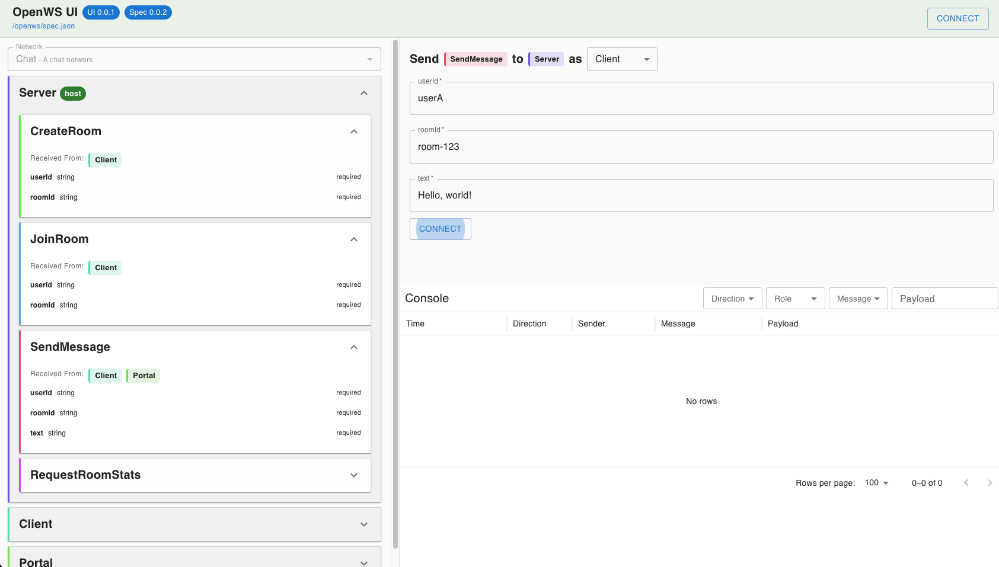

# OpenWS UI

**OpenWS UI** is a generic web UI for exploring and exercising **OpenWS specs** — similar in spirit to Swagger UI, but for OpenWS/WebSocket-style message networks.

It renders an OpenWS spec into:

- a left navigation tree (networks → roles → messages)
- message “send” forms generated from payload schemas
- a console view for sent/received traffic with filtering
- a connect flow to select a host endpoint (when configured)

> This package is framework-agnostic. It ships the UI assets and a small helper (`openwsUiRoot`) to let you serve them from any backend.



---

## Install

```bash
npm i @polytric/openws-ui
```

---

## What you get

This package is intended to be used by server integrations (Fastify, Express, etc.):

- **`openwsUiRoot`**: an absolute path to the built UI assets directory (so your server can serve them via its static-file middleware).

---

## Serving OpenWS UI (framework-agnostic)

At runtime, OpenWS UI needs two things:

1. A **spec URL** it can fetch (your server should expose this JSON).
2. An **index.html config injection** so the UI knows where the spec is and (optionally) which roles are “hosts” for connection presets.

### Runtime config format

OpenWS UI expects a JSON blob embedded in the page:

```html
<script id="openws-ui-config" type="application/json">
    {
        "specUrl": "/openws/spec.json",
        "networkHosts": {
            "Chat": ["Server"]
        }
    }
</script>
```

- `specUrl` (string): where the UI fetches your OpenWS spec JSON.
- `networkHosts` (record): `{ [networkName: string]: string[] }`, listing which roles are considered _hosts_ for that network.
    - This is used to drive the “Connect” dialog presets.

### Minimal server responsibilities

Your server should:

- Serve static assets from `openwsUiRoot` (usually under `/openws/`)
- Serve your spec JSON at something like `/openws/spec.json`
- Serve the UI entry route `/openws/` and inject the runtime config into `index.html`

---

## Example: Injecting runtime config

Pseudo-code (the same approach works in Fastify/Express/Koa/etc.):

```ts
import fs from 'node:fs'
import path from 'node:path'
import { openwsUiRoot } from '@polytric/openws-ui'

const indexTemplate = fs.readFileSync(path.join(openwsUiRoot, 'index.html'), 'utf8')

function renderIndexHtml({
    specUrl,
    networkHosts,
}: {
    specUrl: string
    networkHosts: Record<string, string[]>
}) {
    return indexTemplate.replace(
        '<!--OPENWS_UI_CONFIG-->',
        `<script id="openws-ui-config" type="application/json">${JSON.stringify({ specUrl, networkHosts })}</script>`
    )
}
```

> **Important:** the UI build includes an `index.html` with an `<!--OPENWS_UI_CONFIG-->` placeholder. Your server should replace that placeholder with the runtime config script tag.

---

## Notes

- OpenWS UI is a **frontend**—it does not implement server-side WebSocket logic.
- The UI is driven entirely by the **OpenWS spec** you provide.
- If you’re using Fastify, see `@polytric/fastify-openws-ui` for a ready-to-use integration.

---

## License

Licensed under the **Apache License 2.0**. See `LICENSE`.
